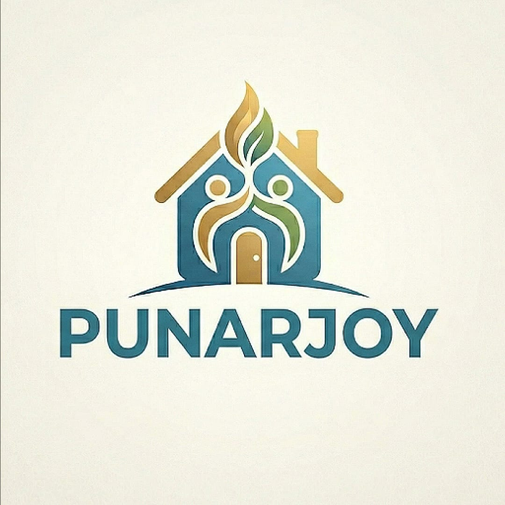

# Punarjoy — Antigravity Prompt Sequence

> Use these prompts in order. Complete and test each before moving to the next.
> Commit after every prompt: `git add . && git commit -m "prompt-N: [section]"`

---

## PROMPT 0 — Project Setup

```
Create a new Vite project with vanilla HTML/CSS/JS (no framework).

Folder structure:
- index.html at root
- css/ folder with these empty files: tokens.css, reset.css, global.css, navbar.css, hero.css, tabs.css, cards.css, pg-section.css, rooms-section.css, features.css, booking.css, footer.css
- js/ folder with: main.js, navbar.js, tabs.js, price-toggle.js, booking.js
- assets/ folder (empty for now)

In index.html:
- Import Barlow Condensed from Google Fonts (weights 400, 600) in <head>
- Link to css/tokens.css first, then css/reset.css, then css/global.css
- Single <script type="module" src="js/main.js"> at bottom of body
- Add skeleton section placeholders with IDs: #pgs, #rooms, #features, #booking
- Add <nav id="navbar"> and <footer id="footer">

In vite.config.js:
- Set base: '/punarjoy/'

In package.json:
- Add "deploy": "npm run build && npx gh-pages -d dist" script
```

---

## PROMPT 1 — Design Tokens

```
Populate css/tokens.css with ALL of these CSS custom properties exactly as written:

:root {
  /* Colors */
  --color-the-green: #027b49;
  --color-the-pink: #f19ec8;
  --color-the-red: #fa4d43;
  --color-the-yellow: #fbb833;
  --color-concrete: #d9d9d9;
  --color-iron: #1f1f1f;
  --color-carbon: #000000;

  /* Typography */
  --font-primary: 'Barlow Condensed', ui-sans-serif, system-ui, sans-serif;
  --font-system: system-ui, -apple-system, 'Segoe UI', sans-serif;
  --font-weight-regular: 400;
  --font-weight-semibold: 600;

  /* Type scale */
  --text-caption: 12px;
  --text-body: 15px;
  --text-body-sm: 18px;
  --text-subheading: 26px;
  --text-heading: 60px;
  --text-display: 80px;

  /* Line heights */
  --leading-display: 0.75;
  --leading-heading: 0.8;
  --leading-subheading: 1;
  --leading-body: 1.2;

  /* Letter spacing */
  --tracking-display: -0.06em;
  --tracking-heading: -0.03em;
  --tracking-body: -0.01em;

  /* Spacing */
  --spacing-5: 5px;
  --spacing-8: 8px;
  --spacing-10: 10px;
  --spacing-14: 14px;
  --spacing-20: 20px;
  --spacing-24: 24px;
  --spacing-30: 30px;
  --spacing-40: 40px;
  --spacing-50: 50px;
  --spacing-100: 100px;

  /* Border radius */
  --radius-pill: 100px;
  --radius-card: 0px;
  --radius-circle: 50%;

  /* Layout */
  --page-max-width: 1440px;
  --section-gap: 40px;
}

Then populate css/reset.css:
*, *::before, *::after { box-sizing: border-box; margin: 0; padding: 0; }
body { background: var(--color-concrete); font-family: var(--font-primary); color: var(--color-iron); font-weight: 400; }
img { display: block; max-width: 100%; }
a { color: inherit; text-decoration: none; }
button { cursor: pointer; border: none; background: none; font-family: inherit; }

Then populate css/global.css:
- .container: max-width var(--page-max-width), margin 0 auto, padding 0 var(--spacing-20)
- .hairline: width 100%, height 1px, background var(--color-iron), border none
- .pill-btn: background var(--color-iron), color var(--color-concrete), border-radius var(--radius-pill), padding 10px 20px, font-family var(--font-primary), font-size var(--text-body), font-weight 400, letter-spacing var(--tracking-body), display inline-block
- .pill-tag: border 1px solid var(--color-iron), border-radius var(--radius-pill), padding 4px 12px, font-size var(--text-caption), background transparent, color var(--color-iron)
- .pill-tag--filled: background var(--color-iron), color var(--color-concrete), border-color var(--color-iron)
```

---

## PROMPT 2 — Navbar

```
Build the navbar in index.html and css/navbar.css and js/navbar.js.

HTML structure inside <nav id="navbar">:
- Left:  (height 40px)
- Center (desktop only): text links — PGs, Rooms, Book Now — href="#pgs", "#rooms", "#booking"
- Right: pill button "Enquire" linking to "#booking" + hamburger button (mobile only)

CSS in navbar.css:
- Position sticky, top 0, z-index 100
- Background var(--color-concrete)
- Border-bottom 1px solid var(--color-iron)
- Height 64px, display flex, align-items center, justify-content space-between
- padding 0 var(--spacing-20)
- Nav links: Barlow Condensed 15px var(--color-iron), no underline, gap var(--spacing-24) between them
- Hamburger: 48px circle, background var(--color-iron), display none on desktop
- Hamburger lines: 3 white horizontal lines, 18px wide, 2px height, gap 4px
- Mobile drawer: full-width, bg var(--color-concrete), border-bottom 1px solid var(--color-iron), links stacked 24px each, hidden by default, slides down on toggle
- @media (max-width: 767px): hide center nav links, show hamburger

JS in navbar.js:
- Toggle .drawer-open class on drawer when hamburger clicked
- Close drawer when any nav link inside it is clicked
- Import and call from main.js
```

---

## PROMPT 3 — Hero Section

```
Build the hero section in index.html and css/hero.css.

HTML inside <section id="hero">:
- Wrapper div.container
- h1 with text: "YOUR HOME<br>AWAY FROM<br>HOME"
- p.subline: "All-inclusive PGs & Rooms — built for comfort, priced for everyone."
- div.hero-ctas: two .pill-btn links: "Explore PGs" (href="#pgs") and "Explore Rooms" (href="#rooms")
- div.trust-badges: span items separated by · : "AC Rooms", "4 Meals Daily", "Free WiFi", "100 Units Electricity"
- hr.hairline at bottom

CSS in hero.css:
- Section: min-height 100vh, bg var(--color-concrete), display flex, align-items center
- h1: font-family var(--font-primary), font-size var(--text-display), line-height var(--leading-display), letter-spacing var(--tracking-display), color var(--color-iron), font-weight 400
- @media (max-width: 767px): h1 font-size 48px
- .subline: font-size var(--text-subheading), line-height var(--leading-subheading), letter-spacing var(--tracking-heading), margin-top var(--spacing-20)
- .hero-ctas: display flex, gap var(--spacing-14), margin-top var(--spacing-30)
- .trust-badges: font-size var(--text-body), color var(--color-iron), margin-top var(--spacing-24), letter-spacing var(--tracking-body)
- .trust-badges span: display inline, margin 0 6px
```

---

## PROMPT 4 — Service Anchor Tabs

```
Build sticky service tabs in index.html and css/tabs.css and js/tabs.js.

HTML: <div id="service-tabs"> with two buttons: "PGs" and "Rooms"

CSS in tabs.css:
- Position sticky, top 64px (below navbar), z-index 99
- Bg var(--color-concrete), border-bottom 1px solid var(--color-iron)
- Display flex, gap var(--spacing-10), padding var(--spacing-10) var(--spacing-20)
- Each button: Barlow Condensed 18px var(--color-iron), no border, bg transparent, padding 8px 20px, radius var(--radius-pill)
- Active state (.active): bg var(--color-iron), color var(--color-concrete)

JS in tabs.js:
- Click "PGs" → smooth scroll to #pgs, set active class on that button
- Click "Rooms" → smooth scroll to #rooms, set active class on that button
- Import and call from main.js
```

---

## PROMPT 5 — Plan Cards (Shared Component)

```
Build the shared card component in css/cards.css.

A .plan-card has:
- display flex, flex-direction column
- border-radius var(--radius-card) (0px)
- overflow hidden
- border-bottom 1px solid var(--color-iron)

.plan-card__image:
- width 100%, aspect-ratio 4/3, object-fit cover, display block

.plan-card__body:
- bg var(--color-concrete)
- padding var(--spacing-20)
- display flex, flex-direction column, gap var(--spacing-10)

.plan-card__title: font-size var(--text-subheading), line-height 1, letter-spacing var(--tracking-heading)

.plan-card__tags: display flex, flex-wrap wrap, gap var(--spacing-8)

.plan-card__price: font-size var(--text-body-sm), letter-spacing var(--tracking-body)

.plan-card__price-amount: font-size var(--text-heading), line-height var(--leading-heading), letter-spacing var(--tracking-heading)

.plan-card__chips: display flex, flex-wrap wrap, gap var(--spacing-8)

.plan-card__note: font-family var(--font-system), font-size var(--text-caption), color var(--color-iron), opacity 0.7

.plan-card__cta: margin-top auto, align-self flex-start

Also build the monthly/yearly price toggle in js/price-toggle.js:
- Each card has data-monthly and data-yearly attributes
- Toggle buttons inside card switch between the two values
- Active toggle button gets .active class (pill-btn style), inactive is plain text
- Import and call from main.js
```

---

## PROMPT 6 — PG Section

```
Build the PG section in index.html and css/pg-section.css.

HTML inside <section id="pgs">:

Header block:
- div.section-header with bg var(--color-the-green), padding var(--spacing-40) var(--spacing-20)
- h2 "PUNARJOY PGs" — 60px var(--color-concrete) letter-spacing -0.03em line-height 0.8
- p.section-sub "All-inclusive · Meals · AC · WiFi" — 18px var(--color-concrete)
- hr in rgba(255,255,255,0.3)

Cards grid div.cards-grid below header:
4 .plan-card elements with this data:

Card 1 — Double Sharing:
  data-monthly="₹15,000" data-yearly="₹1,50,000"
  img src="https://placehold.co/800x600/d9d9d9/1f1f1f?text=Double+Sharing"
  title: "Double Sharing"
  tags: none
  chips: AC · 4 Meals · WiFi · Cleaning · 100 Units
  note: "★ Yearly plan includes Transportation"

Card 2 — Single Sharing:
  data-monthly="₹20,000" data-yearly="₹2,00,000"
  img src="https://placehold.co/800x600/d9d9d9/1f1f1f?text=Single+Sharing"
  title: "Single Sharing"
  tags: none
  chips: AC · 4 Meals · WiFi · Cleaning · 100 Units
  note: "★ Yearly plan includes Transportation"

Card 3 — Double Sharing Premium:
  data-monthly="₹17,000" data-yearly="₹1,70,000"
  img src="https://placehold.co/800x600/d9d9d9/1f1f1f?text=Double+Premium"
  title: "Double Sharing Premium"
  tags: PREMIUM (pill-tag--filled), Balcony (pill-tag)
  chips: AC · 4 Meals · WiFi · Cleaning · 100 Units
  note: "★ Yearly plan includes Transportation"

Card 4 — Single Sharing Premium:
  data-monthly="₹22,000" data-yearly="₹2,20,000"
  img src="https://placehold.co/800x600/d9d9d9/1f1f1f?text=Single+Premium"
  title: "Single Sharing Premium"
  tags: PREMIUM (pill-tag--filled), Balcony (pill-tag)
  chips: AC · 4 Meals · WiFi · Cleaning · 100 Units
  note: "★ Yearly plan includes Transportation"

CSS in pg-section.css:
- .cards-grid: display grid, grid-template-columns 1fr 1fr (desktop), 1fr (mobile), gap 0
- Each card separated by 1px solid var(--color-iron) borders
- Section top border: 1px solid var(--color-iron)
```

---

## PROMPT 7 — Rooms Section

```
Build the Rooms section in index.html and css/rooms-section.css.

HTML inside <section id="rooms">:

Header block:
- bg var(--color-the-yellow), same structure as PG header
- h2 "PUNARJOY ROOMS" — 60px var(--color-iron) (dark on yellow)
- p.section-sub "Private rooms — your space, your rules"

Cards grid — 2 cards:

Card 1 — Normal Room:
  data-monthly="₹11,000" data-yearly="₹1,00,000"
  img src="https://placehold.co/800x600/d9d9d9/1f1f1f?text=Punarjoy+Rooms"
  title: "Normal Room"
  tags: none
  no chips (rooms don't include meals)

Card 2 — Premium Room:
  data-monthly="₹13,000" data-yearly="₹1,20,000"
  img src="https://placehold.co/800x600/d9d9d9/1f1f1f?text=Punarjoy+Rooms"
  title: "Premium Room"
  tags: PREMIUM (pill-tag--filled), Balcony (pill-tag)
  no chips

CSS in rooms-section.css:
- .cards-grid: 2-col desktop, 1-col mobile
- Same border treatment as pg-section
```

---

## PROMPT 8 — Why Punarjoy Strip

```
Build the features section in index.html and css/features.css.

HTML inside <section id="features">:
- Full-bleed bg var(--color-the-pink)
- padding var(--spacing-50) var(--spacing-20)
- h2 "EVERYTHING INCLUDED" — 60px var(--color-iron), -0.03em, line-height 0.8
- div.features-grid with 6 items (text only, no icons):
  1. AC Rooms
  2. 4 Time Meals
  3. Free WiFi
  4. Daily Cleaning
  5. 100 Units Electricity
  6. Yearly Transportation

CSS in features.css:
- .features-grid: display grid, grid-template-columns repeat(6, 1fr) desktop / repeat(2, 1fr) mobile
- Each item: padding var(--spacing-20), font-size var(--text-body-sm), border-right 1px solid var(--color-iron)
- Last item: no border-right
- Top border 1px solid var(--color-iron), bottom border 1px solid var(--color-iron) on the grid
```

---

## PROMPT 9 — Booking Section

```
Build the booking section in index.html and css/booking.css and js/booking.js.

HTML inside <section id="booking">:
- Full-bleed bg var(--color-the-red)
- padding var(--spacing-50) var(--spacing-20)
- h2 "BOOK YOUR ROOM" — 60px var(--color-concrete), -0.03em, line-height 0.8
- p.booking-sub "Pay ₹6,000 security deposit to confirm. Verified within 24 hours." — 18px var(--color-iron)
- div.booking-layout (2-col desktop / stacked mobile):

  Left col div.booking-qr:
  - img.qr-img src="assets/qr.png" alt="UPI QR Code" (placeholder: https://placehold.co/200x200/d9d9d9/1f1f1f?text=QR+Code)
  - p "Scan to pay ₹6,000 security deposit" — 15px var(--color-concrete)
  - p.upi-id "UPI ID: punarjoy@upi" — 15px var(--color-concrete) (update before launch)

  Right col: <form id="booking-form" action="https://formspree.io/f/REPLACE_ME" method="POST" enctype="multipart/form-data">
  Fields (all inputs: border 1px solid var(--color-iron), no border-radius, bg var(--color-concrete), padding 12px, font-family Barlow Condensed, font-size 15px, width 100%):
    - input[name="name"] placeholder "Full Name" required
    - input[type="email" name="email"] placeholder "Email Address" required
    - input[type="tel" name="phone"] placeholder "Phone Number" required
    - select[name="room_type"] required: options — Double Sharing, Single Sharing, Double Sharing Premium, Single Sharing Premium, Normal Room, Premium Room
    - div.plan-toggle: two buttons "Monthly" and "Yearly" + hidden input[name="plan"] updated by JS
    - input[type="file" name="payment_screenshot" accept="image/*"] label "Upload Payment Screenshot" required
    - button.pill-btn type="submit" text "Confirm Booking"

  Success message div (hidden by default): "Booking received! We'll confirm your room within 24 hours."

CSS in booking.css:
- .booking-layout: display grid, grid-template-columns 1fr 2fr desktop / 1fr mobile, gap var(--spacing-40)
- .booking-qr: display flex, flex-direction column, align-items center, gap var(--spacing-14)
- .qr-img: width 200px, height 200px, border 1px solid var(--color-concrete)
- form: display flex, flex-direction column, gap var(--spacing-14)
- select, input: all inputs same style, appearance none on select
- .plan-toggle: display flex, gap var(--spacing-10)
- .plan-toggle button.active: pill-btn style (bg iron, text concrete)
- .plan-toggle button: plain text style

JS in booking.js:
- Plan toggle: click Monthly/Yearly sets .active, updates hidden input value
- On form submit: prevent default, use fetch to POST to Formspree
- On success: hide form, show success message
- Import and call from main.js
```

---

## PROMPT 10 — Footer

```
Build the footer in index.html and css/footer.css.

HTML inside <footer id="footer">:
- Border-top 1px solid var(--color-iron)
- Bg var(--color-concrete)
- padding var(--spacing-40) var(--spacing-20)
- div.footer-main (3-col desktop / stacked mobile):
  Left: img src="assets/logo_p.jpeg" height 36px + span "PUNARJOY" Barlow Condensed 26px
  Center: nav links — PGs (href #pgs) · Rooms (href #rooms) · Book Now (href #booking)
  Right: "📞 [phone]" and "✉ [email]" — update before launch
- hr.hairline
- p.footer-copy "© 2025 Punarjoy. All rights reserved." — system-sans 12px, centered

CSS in footer.css:
- .footer-main: display grid, grid-template-columns 1fr 1fr 1fr desktop / 1fr mobile, gap var(--spacing-30), align-items center
- .footer-copy: font-family var(--font-system), font-size var(--text-caption), text-align center, margin-top var(--spacing-20), opacity 0.6
- Links: Barlow Condensed 15px var(--color-iron), no underline, gap var(--spacing-20) between them
```

---

## PROMPT 11 — Polish & Responsive QA

```
Review the entire page and fix these specific things:

1. On mobile (max-width 767px):
   - Navbar: only logo + hamburger visible. Drawer menu drops down full-width when hamburger clicked.
   - Hero h1: max font-size 48px
   - Cards grid: always 1 column
   - Features grid: 2 columns
   - Booking layout: stacked (QR above, form below)
   - Footer: stacked, center-aligned

2. Check all sections have a top 1px solid #1f1f1f border separating them.

3. Ensure no box-shadows, no gradients, no border-radius on cards or inputs anywhere.

4. Pill buttons on hover: opacity 0.85, no transform/lift.

5. Smooth scroll behavior: add scroll-behavior: smooth to html element.

6. Tab focus styles: outline 2px solid var(--color-iron) offset 2px on all interactive elements (accessibility).

7. Alt text on all images is descriptive and present.

8. All form fields have associated <label> elements (even if visually hidden) for accessibility.
```

---

## PROMPT 12 — Deploy

```
1. Update vite.config.js base to '/punarjoy/' (or actual repo name)
2. Run: npm run build
3. Run: npx gh-pages -d dist
4. Confirm GitHub Pages is set to gh-pages branch in repo settings
5. Test live URL on mobile and desktop
```

---

## Pre-Launch Swaps (do before Prompt 12)

| Item | File | Action |
|------|------|--------|
| Room images | `assets/double.jpeg` etc. | Replace placehold.co URLs with real image paths |
| QR code | `assets/qr.png` | Add client's UPI QR |
| UPI ID | booking section HTML | Update "punarjoy@upi" to real ID |
| Formspree endpoint | booking form action | Replace `REPLACE_ME` with real endpoint |
| Phone number | footer HTML | Add real number |
| Email | footer HTML | Add real email |
